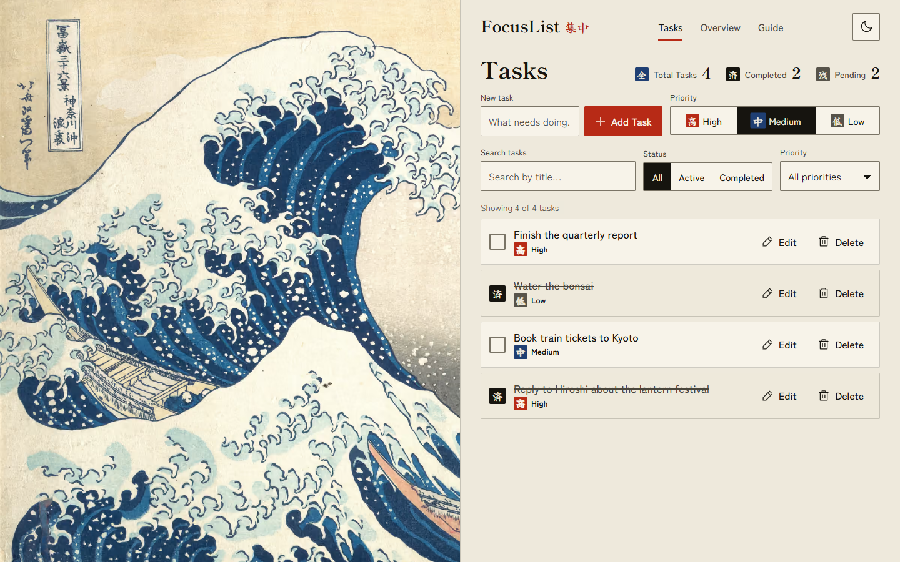
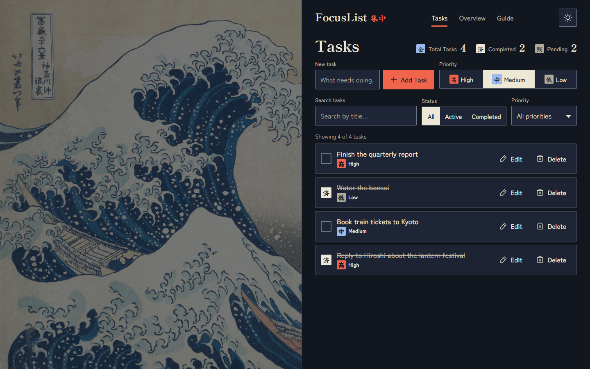
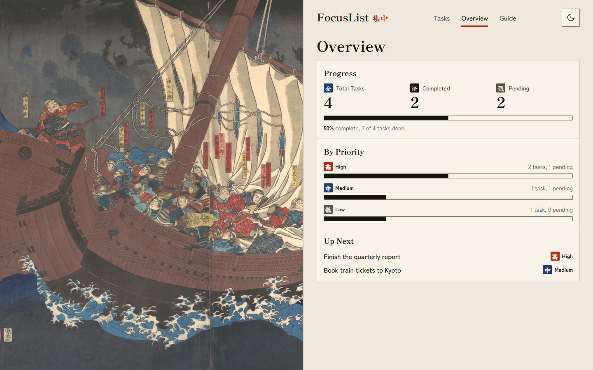
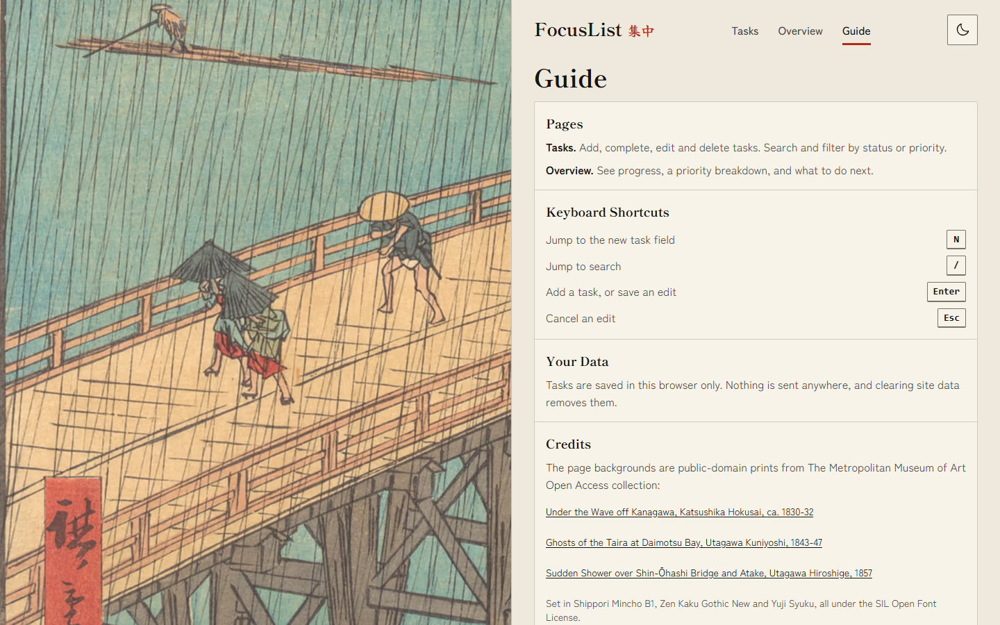
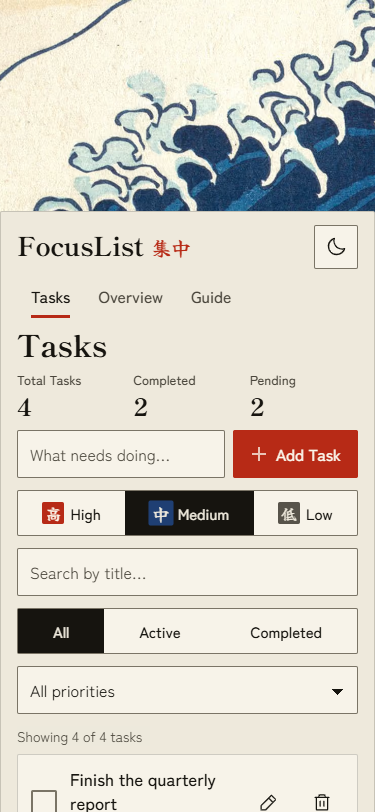
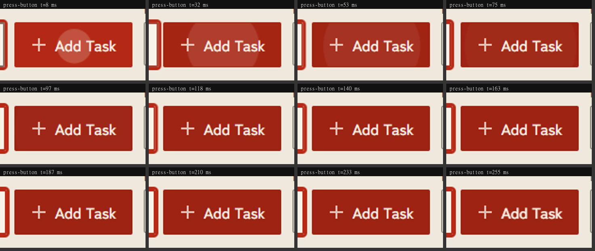
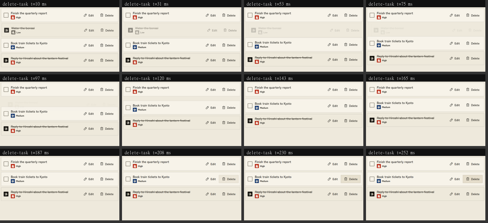
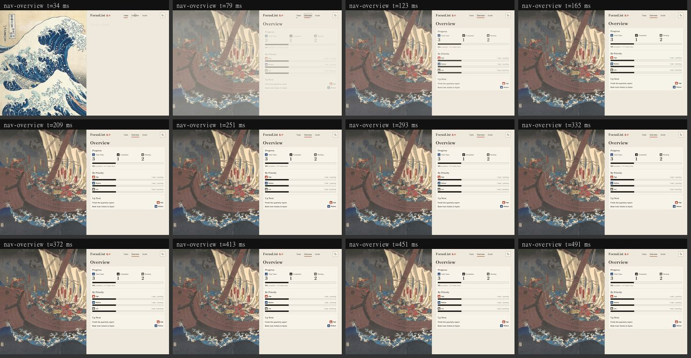

# FocusList

A frontend-only to-do app set in front of real Japanese woodblock prints. Tasks, priorities, search, filters and live statistics, where every click, tick, edit and delete is answered by a small, quick gesture of ink.

Live demo: https://webrushhack.vercel.app

Source: https://github.com/GuruSGC/focuslist

## Overview

FocusList is a small React app with three short pages that fit the screen, so nothing needs long scrolling:

- **Tasks**: add, complete, edit and delete tasks; search and filter; live statistics.
- **Overview**: completion progress, a priority breakdown, and the next tasks to do.
- **Guide**: how the app works, keyboard shortcuts, where your data lives, and credits.

Each page sits beside a real public-domain print from The Metropolitan Museum of Art: Hokusai's *The Great Wave* on Tasks, Kuniyoshi's *Ghosts of the Taira at Daimotsu Bay* on Overview, and Hiroshige's *Sudden Shower over Shin-Ohashi Bridge* on Guide. The prints crossfade as you move between pages.

Everything runs in the browser. There is no backend and no database. Tasks are stored in `localStorage`.

## Features

| Requirement | How it works |
| --- | --- |
| Create tasks | Type a title and press Enter or **Add Task**. Empty, whitespace-only and over-120-character titles show an inline error. |
| Complete, edit, delete | Tick the stamp checkbox to complete. **Edit** opens an inline form (Enter saves, Esc cancels). **Delete** removes the task and offers **Undo** for six seconds. |
| Priority | High, Medium or Low on every task, shown as text plus a seal, never by colour alone. Changeable while editing. |
| Search and filters | Search by title, filter by All / Active / Completed, and by priority. They combine, and the visible list follows the underlying data. A no-results state offers **Clear Filters**. |
| Statistics | **Total Tasks**, **Completed** and **Pending**, on the Tasks and Overview pages, updating on every change. |
| Persistence | Tasks and the theme survive a refresh. Corrupted storage falls back to an empty list. Open tabs stay in sync. |
| Completed vs pending | Completed rows get an ink stamp, a deeper paper tone, and a strike-through that draws left to right. |

Also included: a light and a dark ("night") theme, hash routing with back and forward support, and shortcuts (`N` new task, `/` search).

## Screenshots











## Tech stack

- React 19 and TypeScript (strict)
- Vite and Tailwind CSS v4
- Phosphor icons
- Web Animations API and CSS transitions for all motion (no animation library)
- Vitest for logic tests; Playwright, axe-core and Lighthouse for verification; sharp for the image pipeline
- Fonts self-hosted: Shippori Mincho B1 (display), Zen Kaku Gothic New (interface), Yuji Syuku (kanji seals, subset to seven characters)

## Setup

```bash
npm install
npm run dev        # http://localhost:5173
```

| Script | What it does |
| --- | --- |
| `npm run build` | Type-check and produce the production build in `dist/` |
| `npm run preview` | Serve the production build locally |
| `npm test` | Run the Vitest logic tests |
| `npm run lint` | ESLint |
| `node scripts/build-art.mjs` | Rebuild the page backgrounds from the Met Open Access API |
| `node scripts/motion-lab.mjs` | Film every interaction in slow motion (see Motion) |
| `node scripts/screenshots.mjs` | Regenerate the screenshots above |

## Architecture

```
src/
  types.ts              shared types
  data/paintings.ts     generated: paths, credits and colours of the three prints
  assets/art/           optimised AVIF and WebP crops (desktop and phone)
  lib/
    tasks.ts            pure reducer, validation, filtering, statistics
    storage.ts          versioned localStorage read/write with validation
    routes.ts           hash routes
    motion.ts           motion helpers: ink bloom, wash, shake, ghost exit, theme fade, reflow maths
  hooks/                useTasks, useRoute, useTheme, useFlip (list reflow)
  components/           TaskForm, Toolbar, TaskList, TaskItem, Stats, Header, PaintingBackdrop, ...
  pages/                TasksPage, OverviewPage, GuidePage
tests/                  Vitest tests for tasks, storage, routes and motion maths
scripts/                build-art, motion-lab, and the Playwright and Lighthouse checks
```

Design decisions:

- **Logic is pure and tested.** All task behaviour lives in `lib/tasks.ts`. Components only render and dispatch.
- **Statistics come from the full list**, not the filtered view, so filters never change the totals.
- **Hash routing** works on any static host with no rewrite rules and gives back and forward for free.
- **Real art, small files.** `scripts/build-art.mjs` refuses any print the Met does not flag public domain, crops the paper margins, and writes art-directed desktop and phone crops as AVIF (with WebP fallback), each under 250 KB. Images carry width and height, so nothing shifts.
- **The panel is always solid.** The prints sit behind a papyrus panel, so text never depends on the artwork for contrast. At night the print is dimmed under a veil.

## Motion

Every action answers back, quickly and gently. The personality is a printmaker's studio.

| Action | Motion |
| --- | --- |
| Any button, tab, filter or nav click | A wash of ink blooms from the point of contact and fades (240 ms), and the button presses in slightly |
| Complete a task | The seal stamps down from a little larger and turned, the row deepens, the strike-through draws left to right |
| Add a task | The row arrives, takes a brief wash of colour, and the rows below make way |
| Delete a task | The row lifts away as a hidden copy while the list closes the gap; the toast rises and leaves |
| Edit, Save, Cancel | The form and the row swap in with a short arrival |
| Priority choice | The chosen seal pops slightly |
| Invalid input | A short sideways shake, with the error text and border |
| Changing figures | The number rolls in from below |
| Page change | The painting crossfades and settles, the panel content staggers in, the nav underline slides |
| Theme switch | Colours cross-fade and the print dims or brightens; the icon turns |

Rules it follows, all measured in tests:

- **Sub-300 ms.** Nothing runs longer than 300 ms. Durations come only from tokens (`--dur-*` in `src/index.css`), in CSS and JavaScript alike.
- **State is instant.** The list, totals and ARIA state are correct at the moment of the click. A deleted row leaves the list at once; its exit is an inert, `aria-hidden` copy that removes itself.
- **Never blocking.** Input is accepted mid-animation, and animations are interruptible.
- **Cheap.** Movement uses `transform` and `opacity` only, never a layout property. Lighthouse's "non-composited animations" audit passes.
- **Quiet where it should be.** Typing, the `N` and `/` shortcuts and list-filter typing start no movement.
- **One number sets the pace.** `--motion-scale` scales every duration. `0` turns motion off but keeps every state change.
- **Reduced motion.** Movement is removed and feedback becomes a short fade; state changes still happen.

To see it yourself, run `node scripts/motion-lab.mjs`. It slows the animation clock to 10%, performs each interaction, and writes a labelled filmstrip to `.motion-lab/`. It also prints every animation an interaction started, with its properties, duration and easing.







## Accessibility

- Semantic landmarks, a skip link, one `h1` per page, and focus moved to the page heading on navigation.
- Every control has a visible or accessible name; priority and completion are conveyed by text and shape, not colour alone.
- Full keyboard use: add, complete, edit, delete and undo all work without a mouse, with a visible focus ring everywhere.
- Touch targets are at least 44 px.
- Contrast is AA in both themes. axe reports no serious or critical violations on any page in light or dark.
- `prefers-reduced-motion` and `prefers-color-scheme` are honoured.
- Paintings are decorative: empty alt text, hidden from assistive tech, never receive input. Kanji are decorative seals with `lang="ja"`; all labels are literal English.

## Performance

Measured on the production build (Lighthouse, mobile emulation):

| Performance | Accessibility | Best practices | SEO | CLS |
| --- | --- | --- | --- | --- |
| 95 | 100 | 100 | 100 | 0.001 |

The JavaScript bundle is about 80 KB gzipped and fonts are about 67 KB. Only the current page's print is loaded, at 110 to 240 KB (AVIF), and every interaction paints within 200 ms.

## Deployment

The app is a static build (`npm run build`, output in `dist/`), deployed on Vercel with the default Vite settings: build command `npm run build`, output directory `dist`. Live at https://webrushhack.vercel.app.

To deploy your own copy: `npx vercel deploy --prod`.

## Credits

The page backgrounds are public-domain prints from The Metropolitan Museum of Art Open Access collection: *Under the Wave off Kanagawa* by Katsushika Hokusai (object 45434), *Ghosts of the Taira at Daimotsu Bay* by Utagawa Kuniyoshi (object 55743), and *Sudden Shower over Shin-Ohashi Bridge and Atake* by Utagawa Hiroshige (object 36461). Fonts are used under the SIL Open Font License.
